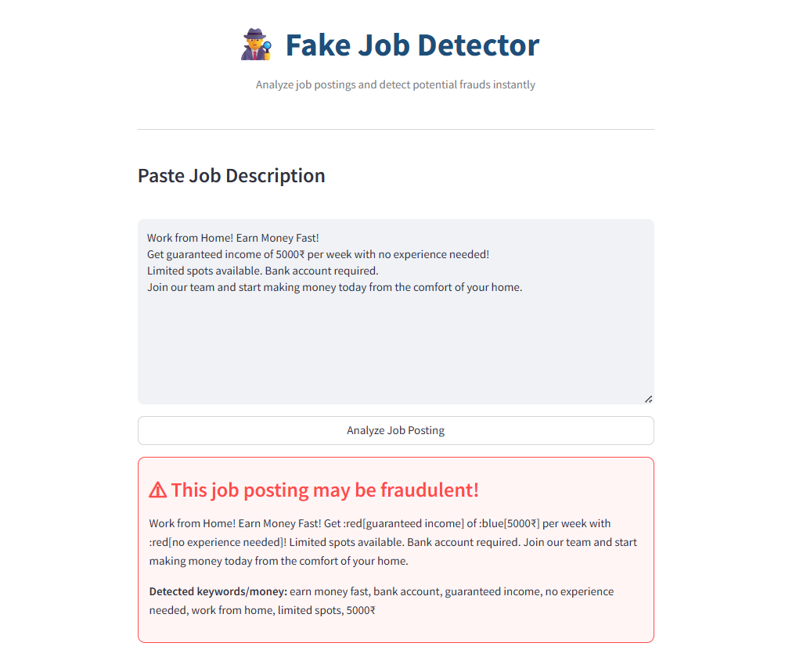

# 🕵‍♂ Fake Job Detector

A beginner-friendly Python project that checks if a job description looks real or suspicious using simple text analysis.

## 🚀 Features
- Detects scam-like patterns  
- Gives a simple fraud score  
- Easy to run, no ML model needed  

## 🛠 Requirements

pip install nltk

## ▶ How to Run

python app.py

## 📦 Project Files
- app.py  
- README.md  
- requirements.txt  
- screenshot.png 

## 📸 Screenshot

## 📌 Note
This is a basic learning project meant for beginners.
